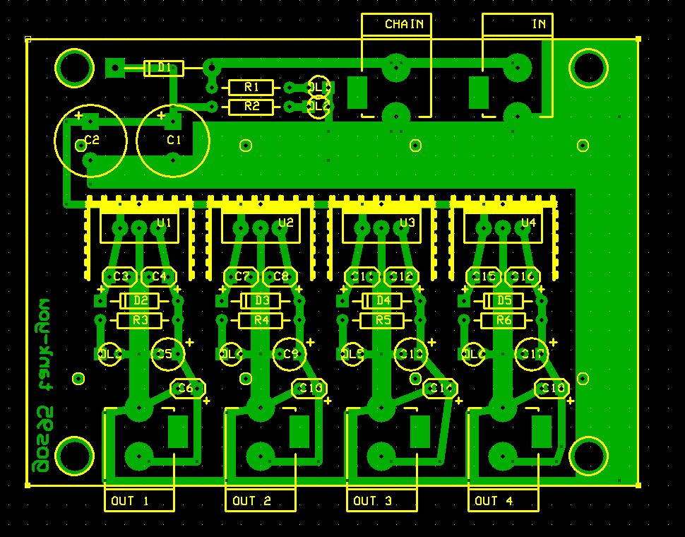

# TankYou
This is an simple project for an inexpensive power supply bank capable of powering small household devices.
My usage of this project is to power audio effect pedals.

## Specifications

### Features
- 12-15V AC/DC power plug for external input power supply
- Input with polarity test (with a led indicating polarity reversal)
- Chain power-plug for a second device
- 4 isolated and stabilized 9V-100mA center-negative output (common ground)

### Hardware
Schematics and PCB layouts are designed with ExpressPCB free CAD software.

#### Schematic:

#### PCB Layout:

## About
Author : Alessandro Fraschetti (mail: [gos95@gommagomma.net](mailto:gos95@gommagomma.net))

## Licence
This project is under the [MIT license](LICENSE).
You are free to use this for any purpose, just try to give credit in the documentation of your project.